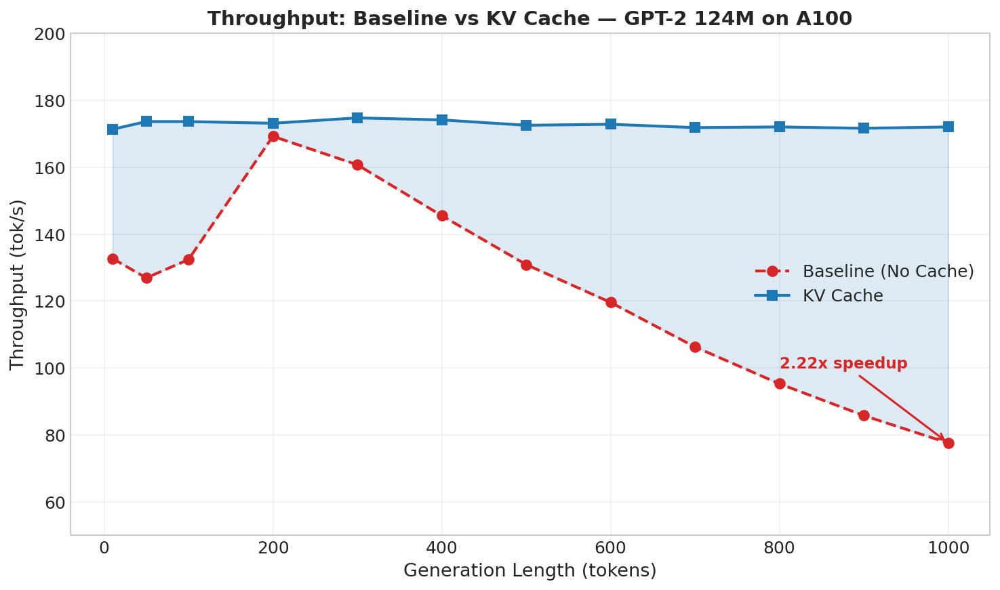
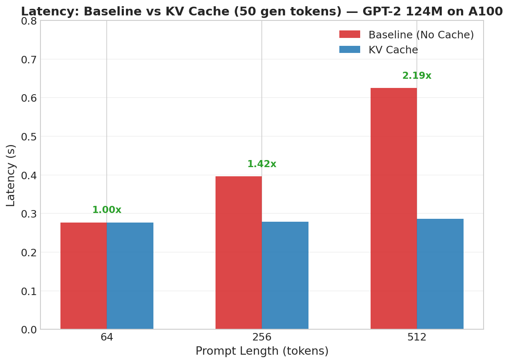
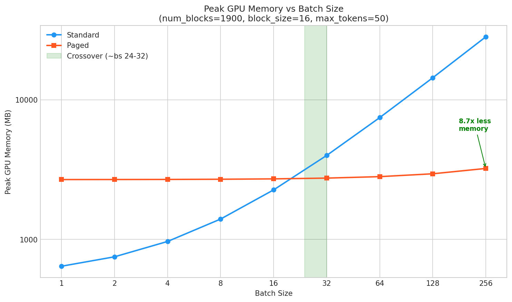
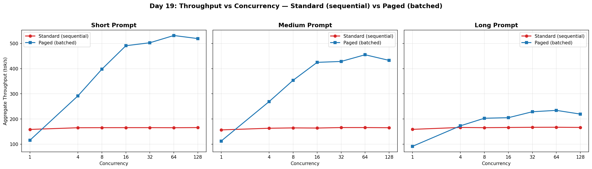

# LLM Inference Engine

A lightweight LLM inference engine built from scratch in PyTorch, inspired by [vLLM](https://github.com/vllm-project/vllm) architecture. Implements core inference optimizations used in production serving systems.

## Motivation

Production LLM serving systems (vLLM, TGI, TensorRT-LLM) are complex codebases with 100K+ lines of C++/CUDA/Python. Understanding *why* they make specific design decisions — KV caching, continuous batching, paged memory — is difficult from reading production code alone.

This project builds an LLM inference engine **from scratch**, implementing each optimization incrementally with benchmarks at every stage. The goal is to deeply understand the inference stack by building it layer by layer:

1. **Transformer forward pass** — understand the computation graph
2. **KV Cache** — eliminate redundant attention recomputation (O(n²) → O(n) per step)
3. **Batched inference** — saturate GPU compute with multiple sequences (118x throughput gain)
4. **Continuous batching** — dynamic scheduling to eliminate idle GPU slots
5. **Paged KV cache** — block-level memory management to eliminate internal fragmentation (8.7x memory reduction at scale)
6. **Serving layer** — FastAPI server with request handling and routing
7. **Load testing** — end-to-end benchmarks under concurrent load (11.1x system throughput)

Each layer builds on the previous one. Benchmarks at each checkpoint quantify the impact of each optimization, creating a complete understanding of *what matters* and *why* in LLM inference.

### Paged KV Cache vs PagedAttention

|                  | Paged KV Cache                                                                                                        | PagedAttention                                                                                                                           |
|------------------|-----------------------------------------------------------------------------------------------------------------------|------------------------------------------------------------------------------------------------------------------------------------------|
| **What**         | Memory management layer — stores KV entries in fixed-size blocks instead of contiguous tensors                        | Complete attention algorithm — computes Q×K^T, softmax, weighted sum directly on non-contiguous blocks in a single fused CUDA kernel     |
| **Components**   | Memory allocator, block table, paged KV cache tensor pool                                                             | Paged KV cache + custom CUDA attention kernel (`paged_attention_v1/v2`)                                                                  |
| **Analogy**      | Virtual memory pages in an OS                                                                                         | Virtual memory + hardware TLB that translates addresses in-line                                                                          |
| **This project** | ✅ Fully implemented (Python)                                                                                         | ❌ Not implemented — would require custom CUDA kernels                                                                                   |
| **Performance**  | Memory savings (up to 8.7x at large batch sizes). ~1.4–1.8x throughput overhead from vectorized Python scatter/gather | Memory savings + zero throughput overhead (fused kernel eliminates Python loops)                                                         |
| **Reference**    | OS virtual memory concepts                                                                                            | [Efficient Memory Management for Large Language Model Serving with PagedAttention](https://arxiv.org/abs/2309.06180) (Kwon et al., 2023) |

**In short:** Paged KV Cache is the data structure. PagedAttention is the data structure + a fused kernel that operates on it. This project implements the former to understand the memory management principles. Production systems (vLLM) add the latter for zero-overhead paged attention.

## Features (Implemented)

- Custom GPT-2 124M transformer (from-scratch forward pass, no HuggingFace model)
- Autoregressive text generation with greedy decoding
- **KV Cache** — pre-allocated per-layer cache for O(n) decode instead of O(n²)
- Benchmark suite (latency, throughput, GPU profiler)
- Pretrained weight loading from OpenAI GPT-2 checkpoints
- **Batch Inference** — static batching with left padding, attention masks, per-sequence EOS tracking (up to 118x throughput gain)
- **Continuous batching scheduler** — iteration-level scheduling with per-sequence KV cache tracking, dynamic slot eviction and refill (step-based scheduler)
- **Paged KV cache** — block-level memory management with memory allocator, block table, and PagedCacheContext adapter (eliminates internal fragmentation)
- **Serving layer** — FastAPI server with `/generate` endpoint, async router with continuous batching, semaphore backpressure (503), request timeout (504)
- **Load testing** — 1–128 concurrent users, paged cache achieves 11.1x system throughput over standard sequential serving

## Future Extensions

- Add Mistral 7B support (RoPE, GQA, RMSNorm, SwiGLU)
- Speculative decoding (GPT-2 small drafts, GPT-2 medium verifies)
- Prefix caching (reuse KV blocks across requests sharing system prompt)
- Custom Triton FlashAttention kernel (fused QK^T → softmax → V, tiled, online softmax)
- Custom Triton PagedAttention kernel (read directly from scattered KV blocks)
- Benchmark against vLLM on matched workloads
- Memory-aware scheduler admission (block budget check before filling slots)
- Priority scheduling (swap FIFO deque for heapq in RequestQueue)

## Benchmark Results

GPT-2 124M on NVIDIA A100-SXM4-80GB, fp32, greedy decoding.

### Throughput: Baseline vs KV Cache



| Generation Length | Baseline    | KV Cache    | Speedup   |
|-------------------|-------------|-------------|-----------|
| 200 tokens        | 169.2 tok/s | 173.1 tok/s | 1.02x     |
| 500 tokens        | 130.9 tok/s | 172.5 tok/s | 1.32x     |
| 1000 tokens       | 77.6 tok/s  | 172.0 tok/s | **2.22x** |

### Latency: Baseline vs KV Cache



| Prompt Length | Baseline | KV Cache | Speedup   |
|---------------|----------|----------|-----------|
| 64 tokens     | 0.277s   | 0.277s   | 1.00x     |
| 256 tokens    | 0.396s   | 0.279s   | 1.42x     |
| 512 tokens    | 0.625s   | 0.286s   | **2.19x** |

### GPU Profiler

| Metric         | Baseline                | KV Cache               | Change                  |
|----------------|-------------------------|------------------------|-------------------------|
| Self CUDA time | 121.90 ms               | 65.14 ms               | **-46.6%**              |
| Dominant kernel| `sgemm` (matrix-matrix) | `gemv` (matrix-vector) | Kernel dispatch changed |

### Batch Inference Throughput (KV Cache enabled)


| Batch Size | Tok/s        | Speedup vs bs=1 | Peak Memory |
|------------|--------------|-----------------|-------------|
| 1          | 155 tok/s    | 1x              | 643 MB      |
| 8          | 1,138 tok/s  | 7.3x            | 1,399 MB    |
| 128        | 11,368 tok/s | 73.3x           | 14,359 MB   |
| 512        | 18,346 tok/s | **118.3x**      | 55,831 MB   |

### Paged KV Cache: Memory vs Batch Size



| Batch Size | Standard Memory | Paged Memory | Winner    | Memory Ratio |
|------------|-----------------|--------------|-----------|--------------|
| 1          | 643 MB          | 2,681 MB     | Standard  | 0.2x         |
| 16         | 2,263 MB        | 2,712 MB     | Standard  | 0.8x         |
| **32**     | **3,991 MB**    | **2,747 MB** | **Paged** | **1.5x**     |
| 64         | 7,447 MB        | 2,814 MB     | Paged     | 2.6x         |
| 256        | 28,183 MB       | 3,220 MB     | Paged     | **8.7x**     |

- **Memory crossover at batch_size ~24-32** — below this, standard's pre-allocated cache is smaller; above it, paged's block pool wins
- **Paged memory nearly flat** (2,681→3,220 MB) regardless of batch size — only allocates blocks actually used
- **Throughput tradeoff:** ~2x slower at small batches due to Python-level scatter/gather (no fused CUDA kernel)
- **OOM boundary:** Standard hits CUDA OOM at batch 1024; paged survives to 1024 (7,312 MB) and hits block exhaustion at 2048 — **9x less memory at batch 512**

### Load Test: Serving Throughput Under Concurrent Load



| Prompt (c=64)  | Standard (sequential) | Paged (batched) | Speedup    |
|----------------|-----------------------|-----------------|------------|
| Short          | 165 tok/s             | 1,840 tok/s     | **11.1x**  |
| Medium         | 166 tok/s             | 1,749 tok/s     | **10.5x**  |
| Long           | 167 tok/s             | 1,582 tok/s     | **9.5x**   |

- Standard throughput is **flat** (~165 tok/s) regardless of concurrency — requests are serialized (`batch_size=1`)
- Paged throughput **scales with concurrency** — peak at c=64 with batched `index_select` reads and advanced-indexing writes
- Long prompts achieve comparable speedups (9.5x) — vectorized `update_cache()` eliminates per-sequence scatter bottleneck

> Full benchmark details: [baseline_benchmark.md](docs/benchmark/baseline_benchmark.md) | [kv_cache_benchmark.md](docs/benchmark/kv_cache_benchmark.md) | [batched_kv_cache_benchmark.md](docs/benchmark/batched_kv_cache_benchmark.md) | [continuous_batching_benchmark.md](docs/benchmark/continuous_batching_benchmark.md) | [paged_kv_cache_benchmark.md](docs/benchmark/paged_kv_cache_benchmark.md) | [load_test_benchmark.md](docs/benchmark/load_test_benchmark.md)

## Project Structure

```bash
src/llm_engine/
├── model/GPT2/           # Custom transformer (attention, block, feedforward)
├── inference/            # Generator, sampler, inference engine
├── cache/                # KV cache, continuous KV cache, paged KV cache, memory allocator, block table
├── scheduler/            # Batch scheduler, continuous batching scheduler, request queue
├── tokenizer/            # HuggingFace tokenizer wrapper
├── serving/              # FastAPI server, request handler, async router, client
├── config/               # YAML config loader (model, scheduler, server)
├── utils/                # Profiler, GPU monitor, weight loader
```

## Quick Start

### Setup

#### 1) Create and activate virtual environment

```bash
python3 -m venv .venv
source .venv/bin/activate
```

#### 2) Install dependencies

```bash
python -m pip install --upgrade pip
pip install -r requirements.txt
```

#### 3) Verify installation

```bash
python -c "import torch, transformers, fastapi; print('OK', torch.__version__, transformers.__version__)"
```

### Run Server

```bash
# Start the FastAPI inference server (loads configs from configs/*.yaml)
PYTHONPATH=. python scripts/run_server.py
```

```bash
# Send a request
curl -X POST http://127.0.0.1:8000/generate \
  -H "Content-Type: application/json" \
  -d '{"prompt": "The meaning of life is", "max_tokens": 50}'
```

### Run Benchmarks

```bash
# Latency benchmark
PYTHONPATH=. python benchmarks/latency/latency_benchmark.py

# Throughput benchmark
PYTHONPATH=. python benchmarks/throughput/throughput_benchmark.py
PYTHONPATH=. python benchmarks/throughput/continuous_batching_benchmark.py
PYTHONPATH=. python benchmarks/throughput/paged_kv_cache_benchmark.py

# GPU profiler
PYTHONPATH=. python -B benchmarks/profiler/profiler_benchmark.py
```

### Run Tests

```bash
PYTHONPATH=src python -m pytest tests/ -v
```

122 tests across 15 test files (attention, caching, generation, scheduling, serving, inference).

### Run Example

```bash
PYTHONPATH=. python examples/simple_generation.py
```

## Documentation

| Document                                                 | Description                                                                                      |
|----------------------------------------------------------|--------------------------------------------------------------------------------------------------|
| [architecture.md](docs/concepts/architecture.md)         | System architecture — 6-layer component diagram, data flow, source map, model interface contract |
| [caching.md](docs/concepts/caching.md)                   | KV cache variants — standard, continuous, paged — with memory benchmark and comparison           |
| [design_decisions.md](docs/concepts/design_decisions.md) | Key design tradeoffs with rationale and vLLM/TGI comparisons                                     |
| [paged_kv_cache.md](docs/concepts/paged_kv_cache.md)     | Paged KV cache deep dive — memory allocator, block table, adapter pattern                        |
| [scheduling.md](docs/concepts/scheduling.md)             | Continuous batching scheduler design                                                             |
| [serving_layer.md](docs/concepts/serving_layer.md)       | Serving architecture — HTTP → Router → Scheduler → Engine                                        |

## Technical Details

- **KV Cache**: Pre-allocated zero tensors per layer, shape `(B, n_heads, max_seq_len, head_dim)`. During decode, only the new token's K/V are appended. Attention computes `Q_new @ K_cached^T` instead of reprocessing the full sequence.
- **Paged KV Cache**: Block pool of shape `(num_blocks, n_heads, block_size, head_dim)` per layer. Memory allocator manages a free list of block IDs. Block table maps `(seq_id, block_idx)` to physical blocks. PagedCacheContext adapter wraps these behind `update_cache(layer_idx, k, v)` for drop-in compatibility with the generator.
- **Continuous Batching**: Iteration-level scheduler that adds/evicts sequences per decode step. ContinuousKVCache tracks per-sequence positions; `reset_slot()` enables slot reuse without recreating the cache.
- **Serving Layer**: FastAPI server with `asyncio.Semaphore` (503 at capacity) and `asyncio.wait_for` (504 on timeout). Async router feeds requests to the continuous batching scheduler.
- **Weight Loading**: Maps OpenAI GPT-2 checkpoint keys to custom model architecture (160 parameters, 124M total) with shape validation logging.
- **Profiling**: `torch.profiler` with CUDA event timing, GPU utilization via `pynvml`, MFU calculation.

## Hardware

|                    |                       |
|--------------------|-----------------------|
| GPU                | NVIDIA A100-SXM4-80GB |
| Peak TFLOPS (fp32) | 19.5                  |
| PyTorch            | 2.4.0+cu121           |
| Python             | 3.10.18               |

## License

This project is licensed under the MIT License - see the [LICENSE](LICENSE) file for details.
