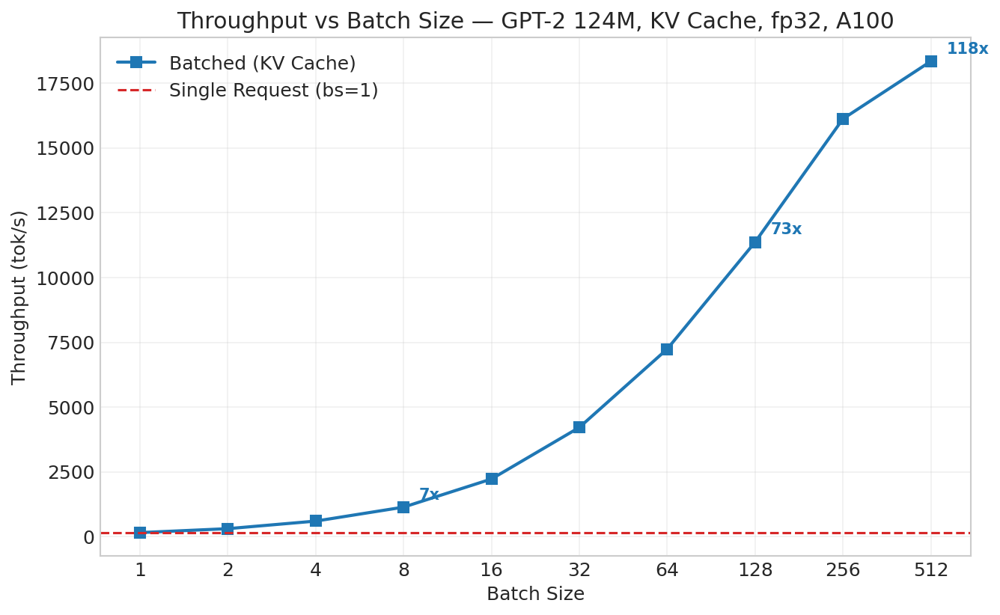
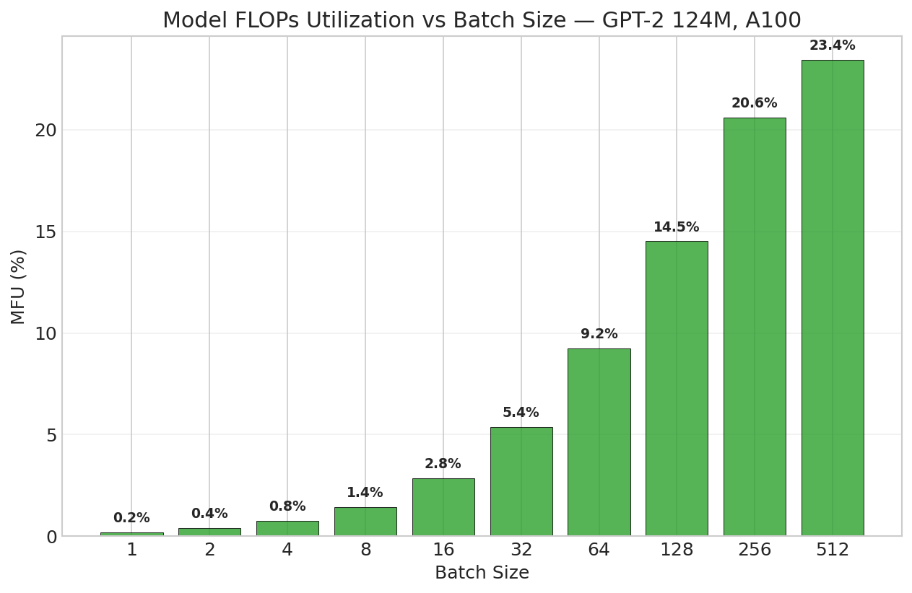
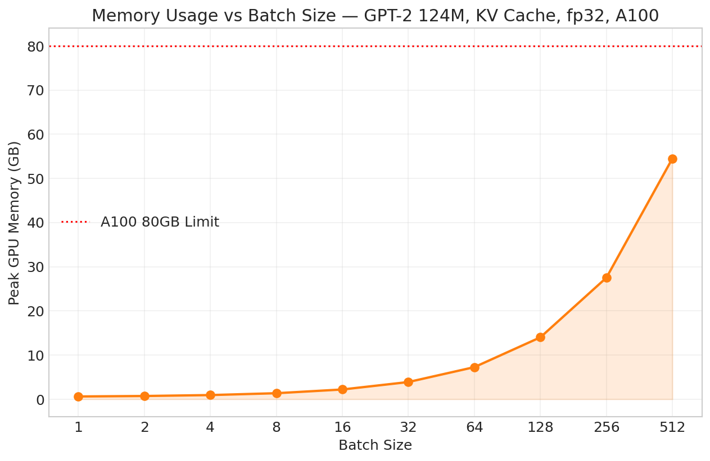

# Batched KV Cache Benchmark — Day 11 (KV Cache + Batching)

## Setup

| Parameter          | Value                                                       |
|--------------------|-------------------------------------------------------------|
| Model              | GPT-2 124M (custom implementation)                          |
| Parameters         | 124,439,808 (160 state_dict keys)                           |
| Precision          | fp32                                                        |
| GPU                | NVIDIA A100-SXM4-80GB                                       |
| Peak TFLOPS (fp32) | 19.5                                                        |
| PyTorch            | 2.4.0+cu121                                                 |
| Python             | 3.10.18                                                     |
| KV Cache           | Pre-allocated per-layer (B, n_heads, max_seq_len, head_dim) |
| Batching           | Static batching with left padding                           |
| Padding            | Left-padded, attention mask = 1 (real) / 0 (pad)            |
| Sampling           | Greedy (argmax)                                             |
| Max Tokens         | 50 per sequence                                             |
| Prompts            | 512 unique prompts of varying lengths                       |

---

## 1. Throughput Benchmark

**Goal:** Measure how batch size affects total throughput (tok/s) with KV cache enabled.

**Config:** Fixed `max_tokens = 50`, varying `batch_size` from 1 to 512. Each batch uses unique prompts of different lengths.

| Batch Size | Total Tokens | Latency (s) | Tok/s    | Peak Mem (MB) | GPU Util (%) | MFU (%) |
|------------|--------------|-------------|----------|---------------|--------------|---------|
| 1          | 50           | 0.322       | 155.1    | 642.8         | 0            | 0.20    |
| 2          | 100          | 0.325       | 307.3    | 750.8         | 36           | 0.39    |
| 4          | 200          | 0.334       | 599.4    | 966.8         | 6            | 0.77    |
| 8          | 400          | 0.351       | 1,138.2  | 1,398.8       | 34           | 1.45    |
| 16         | 800          | 0.360       | 2,223.4  | 2,262.8       | 40           | 2.84    |
| 32         | 1,600        | 0.380       | 4,214.6  | 3,990.8       | 38           | 5.38    |
| 64         | 3,200        | 0.442       | 7,239.9  | 7,446.8       | 35           | 9.24    |
| 128        | 6,400        | 0.563       | 11,367.7 | 14,358.8      | 50           | 14.51   |
| 256        | 12,800       | 0.794       | 16,125.4 | 28,182.8      | 55           | 20.58   |
| 512        | 25,600       | 1.395       | 18,346.3 | 55,830.8      | 44           | 23.42   |

### vs Single Request (KV Cache, batch_size=1)

| Batch Size | Tok/s    | Speedup vs bs=1 | MFU (%) | Peak Mem (MB) | Mem per Seq (MB) |
|------------|----------|-----------------|---------|---------------|------------------|
| 1          | 155.1    | 1.00x           | 0.20    | 642.8         | 642.8            |
| 2          | 307.3    | 1.98x           | 0.39    | 750.8         | 375.4            |
| 4          | 599.4    | 3.87x           | 0.77    | 966.8         | 241.7            |
| 8          | 1,138.2  | **7.34x**       | 1.45    | 1,398.8       | 174.9            |
| 16         | 2,223.4  | 14.34x          | 2.84    | 2,262.8       | 141.4            |
| 32         | 4,214.6  | 27.17x          | 5.38    | 3,990.8       | 124.7            |
| 64         | 7,239.9  | 46.68x          | 9.24    | 7,446.8       | 116.4            |
| 128        | 11,367.7 | 73.29x          | 14.51   | 14,358.8      | 112.2            |
| 256        | 16,125.4 | 103.97x         | 20.58   | 28,182.8      | 110.1            |
| 512        | 18,346.3 | **118.29x**     | 23.42   | 55,830.8      | 109.0            |

**Observations:**

- **Near-linear throughput scaling up to bs=128** — doubling batch size roughly doubles tok/s, confirming the GPU was severely underutilized at bs=1
- **Latency stays nearly flat up to bs=32** (0.322s → 0.380s) — extra sequences are essentially "free" since GPU compute was idle
- **Diminishing returns after bs=256** — tok/s goes from 16,125 → 18,346 (only 1.14x), the GPU is saturating around 20-23% MFU
- **Memory scales linearly** at ~108 MB per additional sequence (KV cache overhead). At bs=512, memory reaches 55.8 GB — approaching the A100's 80 GB limit
- **Memory per sequence decreases** from 642.8 MB (bs=1) to 109.0 MB (bs=512) — fixed model weight overhead is amortized across the batch
- **MFU improved 117x** from 0.20% (bs=1) to 23.42% (bs=512) — batching converts memory-bandwidth-bound decode into compute-bound matmuls

---

## 2. Key Takeaways

### Batching Impact Summary

| Metric      | Single Request (bs=1) | Batched (bs=8) | Batched (bs=128) | Batched (bs=512) |
|-------------|-----------------------|----------------|------------------|------------------|
| Throughput  | 155 tok/s             | 1,138 tok/s    | 11,368 tok/s     | 18,346 tok/s     |
| Speedup     | 1x                    | 7.3x           | 73.3x            | 118.3x           |
| MFU         | 0.20%                 | 1.45%          | 14.51%           | 23.42%           |
| Peak Memory | 643 MB                | 1,399 MB       | 14,359 MB        | 55,831 MB        |
| Latency     | 0.322s                | 0.351s         | 0.563s           | 1.395s           |

### Why Batching Works

1. **GPU compute was idle at bs=1** — single-token decode is a matrix-vector multiply that barely utilizes the A100's 19.5 TFLOPS
2. **Batching converts matmul shapes** from `(1, d) × (d, d)` to `(B, d) × (d, d)` — larger batch dimension saturates tensor cores
3. **Fixed overhead amortized** — model weights, kernel launch, and memory allocation costs are shared across B sequences
4. **KV cache enables flat per-step cost** — without cache, batching would compound the O(n²) attention cost

### Practical Sweet Spots

| Use Case                       | Recommended Batch Size | Rationale                               |
|--------------------------------|------------------------|-----------------------------------------|
| Latency-sensitive (chatbot)    | 8-32                   | <10% latency increase, 7-27x throughput |
| Throughput-optimized (offline) | 128-256                | Best throughput/memory tradeoff         |
| Maximum throughput             | 512                    | Near GPU saturation, but 55 GB memory   |

### Remaining Bottlenecks

1. **Static batching** — all sequences padded to longest, wasting compute on pad tokens. Continuous batching (Day 12-13) will fix this
2. **fp32** — still not utilizing tensor cores optimally; bf16/fp16 would further increase MFU
3. **MFU ceiling at ~23%** — memory bandwidth still limits single-step decode even with large batches
4. **No sequence-level scheduling** — finished sequences waste compute until all sequences complete

### Next Optimization Targets

- **Request Queue + Scheduler** (Day 12): Priority-based request management
- **Continuous Batching** (Day 13): Dynamic add/remove sequences mid-generation
- **Paged KV Cache** (Day 15-16): Block-level memory management to reduce fragmentation
