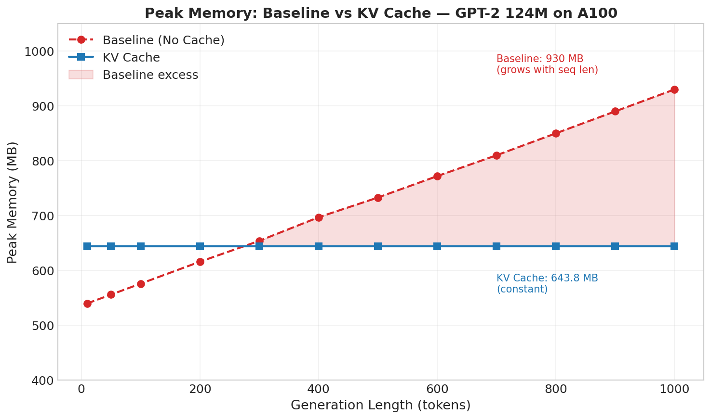

# KV Cache Benchmark — Day 9 (KV Cache Enabled, Single Request)

## Setup

| Parameter | Value |
|-----------|-------|
| Model | GPT-2 124M (custom implementation) |
| Parameters | 124,439,808 (160 state_dict keys) |
| Precision | fp32 |
| GPU | NVIDIA A100-SXM4-80GB |
| Peak TFLOPS (fp32) | 19.5 |
| PyTorch | 2.4.0+cu121 |
| Python | 3.10.18 |
| KV Cache | Pre-allocated per-layer (B, n_heads, max_seq_len, head_dim) |
| Batching | Single request |
| Sampling | Greedy (argmax) |

---

## 1. Latency Benchmark

**Goal:** Measure how prompt length affects end-to-end latency with KV cache.

**Config:** Fixed generation = 50 tokens, varying prompt length.

| Prompt Len | Latency (s) | Tok/s | Peak Mem (MB) | GPU Util (%) | MFU (%) |
|-----------|-------------|-------|---------------|-------------|---------|
| 64 | 0.277 | 180.7 | 643.8 | 30 | 0.23 |
| 256 | 0.279 | 179.4 | 662.2 | 30 | 0.23 |
| 512 | 0.286 | 174.9 | 714.1 | 33 | 0.22 |

### vs Baseline (No KV Cache)

| Prompt Len | Baseline Tok/s | KV Cache Tok/s | Speedup | Baseline Latency (s) | KV Cache Latency (s) |
|-----------|---------------|----------------|---------|----------------------|----------------------|
| 64 | 180.3 | 180.7 | 1.00x | 0.277 | 0.277 |
| 256 | 126.2 | 179.4 | 1.42x | 0.396 | 0.279 |
| 512 | 80.0 | 174.9 | 2.19x | 0.625 | 0.286 |

**Observations:**
- **Latency is nearly flat** across all prompt lengths (~0.277–0.286s) — KV cache eliminates redundant recomputation during decode
- At 64 tokens, no speedup (1.00x) — baseline is already fast at short sequences, cache overhead offsets gains
- At 256 tokens, **1.42x speedup** — KV cache avoids O(n²) attention recomputation
- At 512 tokens, **2.19x speedup** — benefit grows with sequence length as baseline pays increasing quadratic cost
- Peak memory is slightly higher than baseline (643–714 MB vs 580–765 MB) due to pre-allocated cache tensors, but stays constant across decode steps
- GPU utilization is lower (30–33% vs 73–98%) — each decode step processes only 1 token instead of full sequence, so matmuls are smaller (matrix-vector vs matrix-matrix)

---

## 2. Throughput Benchmark

**Goal:** Measure sustained token generation rate across different generation lengths with KV cache.

**Config:** Fixed prompt = `"The meaning of life is"`, varying `max_tokens`.

| Max Tokens | Actual Tokens | Latency (s) | Tok/s | Peak Mem (MB) | GPU Util (%) | Mem Util (%) | MFU (%) |
|-----------|--------------|-------------|-------|---------------|-------------|-------------|---------|
| 10 | 10 | 0.058 | 171.3 | 643.8 | 28 | 6 | 0.22 |
| 50 | 50 | 0.288 | 173.6 | 643.8 | 27 | 6 | 0.22 |
| 100 | 100 | 0.576 | 173.6 | 643.8 | 28 | 6 | 0.22 |
| 200 | 200 | 1.155 | 173.1 | 643.8 | 27 | 6 | 0.22 |
| 300 | 300 | 1.717 | 174.7 | 643.8 | 29 | 6 | 0.22 |
| 400 | 400 | 2.298 | 174.1 | 643.8 | 29 | 6 | 0.22 |
| 500 | 500 | 2.898 | 172.5 | 643.8 | 29 | 6 | 0.22 |
| 600 | 600 | 3.473 | 172.8 | 643.8 | 28 | 6 | 0.22 |
| 700 | 700 | 4.076 | 171.8 | 643.8 | 27 | 6 | 0.22 |
| 800 | 800 | 4.650 | 172.0 | 643.8 | 28 | 6 | 0.22 |
| 900 | 900 | 5.246 | 171.6 | 643.8 | 28 | 6 | 0.22 |
| 1000 | 1000 | 5.814 | 172.0 | 643.8 | 28 | 6 | 0.22 |

### vs Baseline (No KV Cache)

| Max Tokens | Baseline Tok/s | KV Cache Tok/s | Speedup | Baseline Peak Mem (MB) | KV Cache Peak Mem (MB) |
|-----------|---------------|----------------|---------|------------------------|------------------------|
| 10 | 132.7 | 171.3 | 1.29x | 540 | 643.8 |
| 50 | 126.9 | 173.6 | 1.37x | 556 | 643.8 |
| 100 | 132.4 | 173.6 | 1.31x | 576 | 643.8 |
| 200 | 169.2 | 173.1 | 1.02x | 616 | 643.8 |
| 300 | 160.7 | 174.7 | 1.09x | 654 | 643.8 |
| 400 | 145.5 | 174.1 | 1.20x | 697 | 643.8 |
| 500 | 130.9 | 172.5 | 1.32x | 733 | 643.8 |
| 600 | 119.6 | 172.8 | 1.44x | 772 | 643.8 |
| 700 | 106.3 | 171.8 | 1.62x | 810 | 643.8 |
| 800 | 95.3 | 172.0 | 1.80x | 850 | 643.8 |
| 900 | 85.8 | 171.6 | 2.00x | 890 | 643.8 |
| 1000 | 77.6 | 172.0 | 2.22x | 930 | 643.8 |

**Observations:**
- **KV cache throughput is flat at ~172–174 tok/s** across all generation lengths — each decode step has constant cost O(n) instead of O(n²)
- Baseline degrades from 169 → 78 tok/s as generation length grows (quadratic attention recomputation)
- **Speedup grows with sequence length:** 1.02x at 200 tokens → 2.22x at 1000 tokens
- **Peak memory is constant** at 643.8 MB — pre-allocated cache means no memory growth during generation
- Baseline memory grew from 540 → 930 MB over the same range

---

## 3. Profiler Breakdown

**Goal:** Compare CUDA kernel-level execution with and without KV cache.

**Config:** Prompt = `"The capital of France is"`, 50 tokens, `torch.profiler` with CUDA + shapes.

### No KV Cache (Baseline)

| Op | Self CUDA % | CUDA Time |
|-----------------------------------|-------------|-----------|
| `aten::addmm` | 53.2% | 64.84 ms |
| `aten::bmm` | 10.57% | 12.88 ms |
| `aten::mm` | 9.2% | 11.86 ms |
| `cutlass::Kernel` | 9.7% | 11.86 ms |
| `ampere_sgemm_128x128_nn` | 6.6% | 8.05 ms |
| `aten::mul` | 5.4% | 6.65 ms |

**Self CUDA time total: 121.90 ms**

### With KV Cache — Sorted by `cuda_time_total` (top 10)

| Op | Self CUDA % | Self CUDA | CUDA Total | CUDA Time Avg | # Calls |
|---|---|---|---|---|---|
| `aten::addmm` | 40.68% | 26.502 ms | 26.502 ms | 11.042 μs | 2400 |
| `gemvx_kernel` (internal) | 15.91% | 10.361 ms | 10.361 ms | 8.811 μs | 1176 |
| `aten::matmul` | 0.00% | 0.000 ms | 8.567 ms | 6.854 μs | 1250 |
| `gemvx_kernel` (internal) | 10.49% | 6.834 ms | 6.834 ms | 11.622 μs | 588 |
| `aten::layer_norm` | 0.00% | 0.000 ms | 6.139 ms | 4.911 μs | 1250 |
| `aten::native_layer_norm` | 9.42% | 6.139 ms | 6.139 ms | 4.911 μs | 1250 |
| `vectorized_layer_norm_kernel` | 9.42% | 6.139 ms | 6.139 ms | 4.911 μs | 1250 |
| `aten::mul` | 8.68% | 5.655 ms | 5.655 ms | 1.885 μs | 3000 |
| `gemvNSP_kernel` | 7.71% | 5.021 ms | 5.021 ms | 8.540 μs | 588 |
| `aten::add` | 7.38% | 4.809 ms | 4.809 ms | 1.963 μs | 2450 |

**Self CPU time total: 370.09 ms** | **Self CUDA time total: 65.14 ms**

### Comparison

| Metric | No Cache | KV Cache | Change |
|--------|----------|----------|--------|
| Self CUDA time | 121.90 ms | 65.14 ms | **-46.6%** |
| Self CPU time | 367 ms | 370.09 ms | ~same |
| `aten::addmm` | 53.2% (64.84 ms) | 40.68% (26.50 ms) | **-59% absolute time** |
| `aten::bmm` | 10.57% (12.88 ms) | 6.27% (4.08 ms) | **-68% absolute time** |
| `aten::mm` | 9.2% (11.86 ms) | 6.88% (4.48 ms) | **-62% absolute time** |
| `aten::copy_` | negligible | 7.27% (4.74 ms) | New — cache write cost |
| `aten::mul` | 5.4% (6.65 ms) | 8.68% (5.66 ms) | -15% absolute, higher share |
| New: `gemvx_kernel` | — | 15.91% + 10.49% | Matrix-vector dispatch |
| New: `gemvNSP_kernel` | — | 7.71% (5.02 ms) | Attention gemv |
| New: `gemv2T_kernel` | — | 6.68% (4.35 ms) | Prefill mm kernel |
| Dominant kernel type | `sgemm` (matrix-matrix) | `gemv` (matrix-vector) | Kernel dispatch changed |

### Key Findings

- **46.6% reduction in total CUDA time** (121.90 ms → 65.14 ms) — KV cache eliminates redundant key/value recomputation across all 12 transformer layers
- **Matmul cost collapsed:** `addmm` + `bmm` + `mm` dropped from ~89 ms to ~35 ms (−60%)
- **`aten::copy_` appears at 7.27%** (4.74 ms) — the cost of writing new K/V entries into the cache each step (acceptable overhead)
- **Kernel dispatch shifted from `sgemm` to `gemv`** — three gemv kernel variants (`gemvx`, `gemvNSP`, `gemv2T`) now dominate, confirming single-token decode uses matrix-vector ops instead of matrix-matrix
- **`aten::mm` reduced from 11.86 ms to 4.48 ms** — only 50 calls remain (prefill), down from full-sequence matmuls
- **CPU time unchanged** (~370 ms) — the speedup is purely on the GPU side

---

## 4. Key Takeaways

### KV Cache Impact Summary

| Metric | Baseline | KV Cache | Improvement |
|--------|----------|----------|-------------|
| Throughput (short seq) | ~130–170 tok/s | ~172–174 tok/s | ~1.0–1.3x |
| Throughput (1000 tokens) | 77.6 tok/s | 172.0 tok/s | **2.22x** |
| Latency (512 prompt) | 0.625s | 0.286s | **2.19x** |
| CUDA time per step | ~2.4 ms | ~1.3 ms | **46.6% reduction** |
| Peak Memory (1000 gen) | 930 MB | 643.8 MB | **-31% (constant)** |
| Dominant CUDA op | `addmm` 53% | `addmm` 41% | Shifted to gemv |
| Throughput scaling | Degrades O(n²) | Flat O(n) | Constant decode cost |

### Why KV Cache Works

1. **Eliminates redundant computation:** Without cache, each decode step recomputes attention over the _entire_ sequence. With cache, only the new token's Q is computed and multiplied against stored K/V
2. **O(n²) → O(n) per step:** Decode step cost no longer grows with sequence length
3. **Constant memory:** Pre-allocated cache avoids dynamic allocation; peak memory doesn't grow during generation
4. **Better kernel utilization:** Smaller matmuls dispatch efficient gemv kernels instead of underutilized sgemm kernels

### Remaining Bottlenecks

1. **No batching** → single sequence, GPU compute units largely idle (30% utilization)
2. **fp32** → not utilizing tensor cores (bf16/fp16 would 2x throughput)
3. **MFU still ~0.22%** — memory-bandwidth bound for single-sequence decode
4. **Small model** → each decode step is a matrix-vector multiply, cannot saturate GPU

### Next Optimization Targets

- **Batching** (Day 10–11): Multiple sequences in parallel → higher GPU utilization and MFU
- **Continuous Batching** (Day 12+): Dynamic batch scheduling for variable-length requests
- **Paged KV Cache** (Day 14+): Block-level memory management to avoid fragmentation
- **fp16/bf16** (future): 2x tensor core throughput
