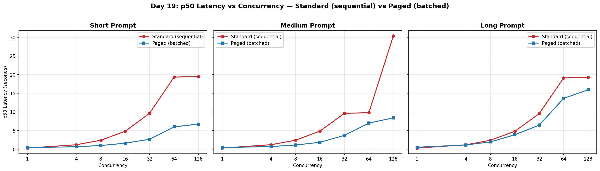
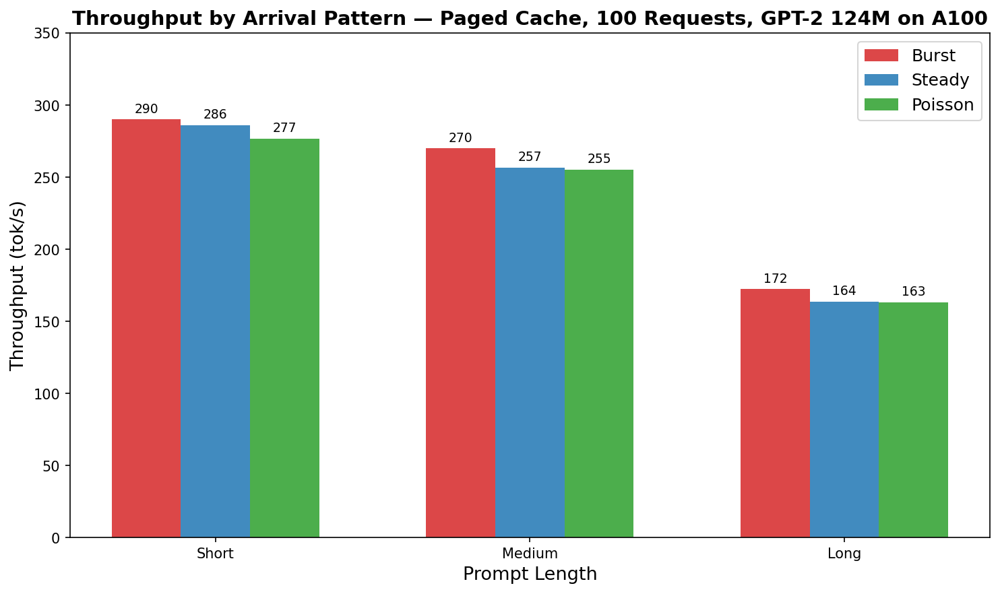
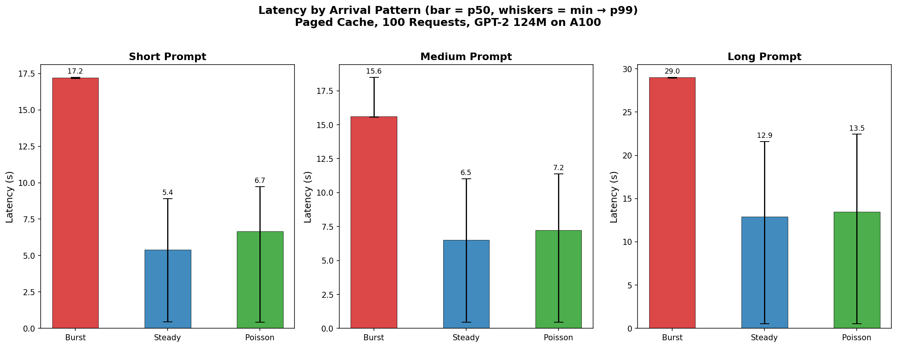
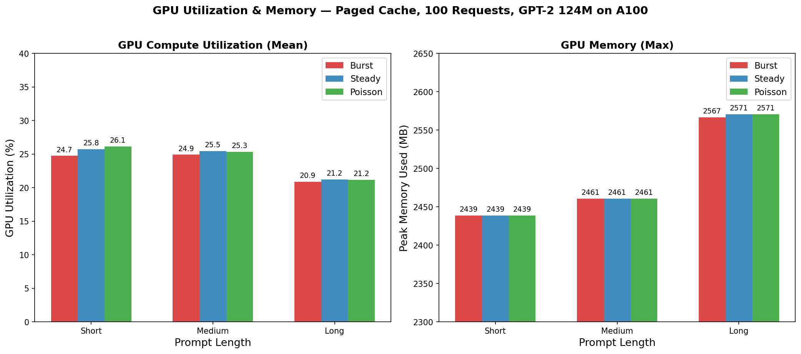

# Load Test Benchmark — Day 19 (Concurrent HTTP Load Testing)

## Setup

| Parameter          | Value                                                                  |
|--------------------|------------------------------------------------------------------------|
| Model              | GPT-2 124M (custom implementation)                                     |
| Parameters         | 124,439,808 (160 state_dict keys)                                      |
| Precision          | fp32                                                                   |
| GPU                | NVIDIA A100-SXM4-80GB                                                  |
| Peak TFLOPS (fp32) | 19.5                                                                   |
| PyTorch            | 2.4.0+cu121                                                            |
| Python             | 3.10.18                                                                |
| Server             | FastAPI + Uvicorn on `127.0.0.1:8000`                                  |
| Client             | `httpx.AsyncClient` with `asyncio.gather` (trust_env=False)            |
| Standard Config    | `batch_size=1`, sequential (no `--async_mode`), KV cache enabled       |
| Paged Config       | `max_batch_size=32`, `--async_mode`, `num_blocks=512`, `block_size=16` |
| Max Tokens         | 50 per request                                                         |
| Concurrency Levels | 1, 4, 8, 16, 32, 64, 128                                               |

**Prompts:**

| Type   | Tokens (~) | Text                                                                                                                                                                          |
|--------|------------|-------------------------------------------------------------------------------------------------------------------------------------------------------------------------------|
| Short  | 6          | "The capital of France is"                                                                                                                                                    |
| Medium | 28         | "Deep learning has revolutionized the field of artificial intelligence by enabling models to learn complex patterns from large datasets without explicit feature engineering" |
| Long   | 56         | "The theory of relativity, proposed by Albert Einstein in the early twentieth century, fundamentally changed our understanding of space, time, and gravity..."                |

**Key difference:** Standard cache uses `batch_size=1` (sequential processing) because its fixed-shape tensors `(B, n_head, max_seq_len, head_dim)` cannot handle dynamic batch sizes. Paged cache uses `--async_mode` with continuous batching — see [design_decisions.md](../concepts/design_decisions.md#2-standard-kv-cache-fixed-batch-size-batch_size1-for-serving).

---

## 1. Aggregate Throughput (tok/s) vs Concurrency

### Standard Cache (Sequential)

| Concurrency | Short tok/s | Medium tok/s | Long tok/s |
|:-----------:|:-----------:|:------------:|:----------:|
| 1           | 158         | 157          | 159        |
| 4           | 165         | 163          | 166        |
| 8           | 165         | 164          | 165        |
| 16          | 166         | 164          | 166        |
| 32          | 166         | 166          | 167        |
| 64          | 165         | 166          | 167        |
| 128         | 166         | 165          | 166        |

### Paged Cache (Batched)

| Concurrency | Short tok/s | Medium tok/s | Long tok/s |
|:-----------:|:-----------:|:------------:|:----------:|
| 1           | 116         | 112          | 91         |
| 4           | 292         | 269          | 173        |
| 8           | 398         | 354          | 203        |
| 16          | 491         | 425          | 205        |
| 32          | 503         | 428          | 229        |
| 64          | **532**     | **455**      | **234**    |
| 128         | 519         | 433          | 219        |

### Side-by-Side (Peak at c=64)

| Prompt | Standard (c=64) | Paged (c=64) | Speedup  |
|--------|-----------------|--------------|----------|
| Short  | 165 tok/s       | 532 tok/s    | **3.2x** |
| Medium | 166 tok/s       | 455 tok/s    | **2.7x** |
| Long   | 167 tok/s       | 234 tok/s    | **1.4x** |

**Observations:**

- Standard throughput is **completely flat** (~165 tok/s) regardless of concurrency — requests are serialized due to `batch_size=1`
- Paged throughput **scales with concurrency** because `_generation_loop` batches multiple requests into a single `engine.generate()` call, enabling GPU parallelism
- Peak throughput at c=64 for all prompt types; slight decline at c=128 due to scheduling overhead and batch cycling
- **Long prompts show smaller gains** because each autoregressive step processes more KV entries — compute per token grows, limiting batching benefits

---

## 2. Latency Distribution

### p50 Latency (seconds)

| Concurrency | Std Short | Paged Short | Std Medium | Paged Medium | Std Long | Paged Long |
|:-----------:|:---------:|:-----------:|:----------:|:------------:|:--------:|:----------:|
| 1           | 0.32      | 0.43        | 0.32       | 0.44         | 0.31     | 0.55       |
| 4           | 1.21      | 0.68        | 1.22       | 0.74         | 1.20     | 1.15       |
| 8           | 2.42      | 1.00        | 2.43       | 1.13         | 2.42     | 1.97       |
| 16          | 4.83      | 1.63        | 4.88       | 1.88         | 4.81     | 3.90       |
| 32          | 9.66      | 2.69        | 9.64       | 3.73         | 9.58     | 6.48       |
| 64          | 19.36     | 6.01        | 9.81       | 7.02         | 19.14    | 13.65      |
| 128         | 19.51     | 6.76        | 30.40      | 8.43         | 19.30    | 15.95      |

### Tail Latency — Short Prompt

| Concurrency | Std p95 (s) | Paged p95 (s) | Std p99 (s) | Paged p99 (s) |
|:-----------:|:-----------:|:-------------:|:-----------:|:-------------:|
| 1           | 0.32        | 0.43          | 0.32        | 0.43          |
| 8           | 2.42        | 1.01          | 2.42        | 1.01          |
| 32          | 9.66        | 2.91          | 9.66        | 3.18          |
| 64          | 19.37       | 6.01          | 19.37       | 6.02          |
| 128         | 12.28       | 12.28         | 12.29       | 12.29         |

**Observations:**

- **At c=1:** Paged is slightly slower (0.43s vs 0.32s) due to paged memory management overhead (block allocation, scatter/gather)
- **At c≥4:** Paged wins — batching amortizes the per-request overhead
- **Standard p50 grows linearly** with concurrency: `p50 ≈ concurrency × single_request_latency`. Classic serial queuing behavior
- **Paged p50 grows sub-linearly** — true batching processes multiple requests per GPU forward pass
- **At c=32, short prompt:** Paged delivers **3.6x lower** p50 latency (2.69s vs 9.66s)

---

## 3. Request Throughput (req/s)

| Concurrency | Std Short | Paged Short | Std Medium | Paged Medium | Std Long | Paged Long |
|:-----------:|:---------:|:-----------:|:----------:|:------------:|:--------:|:----------:|
| 1           | 3.17      | 2.31        | 3.13       | 2.25         | 3.17     | 1.82       |
| 4           | 3.30      | 5.83        | 3.26       | 5.38         | 3.33     | 3.46       |
| 8           | 3.31      | 7.96        | 3.29       | 7.08         | 3.31     | 4.06       |
| 16          | 3.31      | 9.82        | 3.28       | 8.50         | 3.32     | 4.10       |
| 32          | 3.31      | 10.05       | 3.32       | 8.57         | 3.34     | 4.57       |
| 64          | 3.30      | **10.63**   | 3.32       | **9.10**     | 3.34     | **4.68**   |
| 128         | 3.32      | 10.39       | 3.30       | 8.65         | 3.33     | 4.39       |

**Observations:**

- Standard: flat at ~3.3 req/s (one request at a time, each taking ~0.3s)
- Paged short: scales to **10.63 req/s** (3.2x improvement)
- req/s = tok/s ÷ 50 (since max_tokens=50 for all requests)

---

## 4. Failure Rate

**Zero failures across all 1,518 total requests** (7 concurrency levels × 3 prompt types × 2 cache types = 42 runs). The error handling in `_generation_loop` (try/except with `future.set_exception()` and `scheduler.complete_request()`) is working correctly.

---

## 5. Key Takeaways

### Why Paged Cache Enables Dynamic Batching

Standard KVCache pre-allocates tensors of shape `(batch_size, n_head, max_seq_len, head_dim)`. The batch dimension is **fixed at init** — passing N≠batch_size requests causes a RuntimeError. This forces `batch_size=1` in serving mode.

Paged KV cache stores K/V at the per-sequence, per-block level with no batch dimension in the underlying storage. `PagedCacheContext` wraps any number of sequences via a list of sequence IDs, enabling dynamic batch sizes every scheduling step.

### Performance Summary

| Metric                        | Standard (sequential) | Paged (batched) |
|-------------------------------|-----------------------|-----------------|
| Peak short throughput         | 166 tok/s             | 532 tok/s       |
| Peak short req/s              | 3.3                   | 10.6            |
| p50 latency at c=32 (short)   | 9.66s                 | 2.69s           |
| Throughput scaling            | Flat                  | Sub-linear      |
| Failure rate                  | 0%                    | 0%              |

### Throughput Scaling Behavior

- **Standard:** `throughput ≈ constant` — adding more concurrent users just increases queue depth, not GPU parallelism
- **Paged:** `throughput ∝ min(concurrency, max_batch_size)` — scales until GPU compute saturates at ~c=64
- **Diminishing returns past c=64:** GPU is fully utilized; additional requests queue behind the active batch

### Prompt Length Impact on Batching Gains

| Prompt | Paged Speedup (c=64) | Reason                                                                      |
|--------|----------------------|-----------------------------------------------------------------------------|
| Short  | 3.2x                 | Short prefill, GPU mostly idle between tokens → batching fills idle compute |
| Medium | 2.7x                 | More prefill work, slightly less idle time to fill                          |
| Long   | 1.4x                 | Long attention over many KV entries each step → already compute-bound       |

---

## Benchmark Progression

| Stage                        | Day | Context | Batch Size | Short tok/s | Key Gain                     |
|------------------------------|-----|---------|------------|-------------|------------------------------|
| Baseline (no cache)          | 7   | Direct  | 1          | 127 tok/s   | —                            |
| + KV Cache                   | 9   | Direct  | 1          | 174 tok/s   | 1.4x (avoid recomputing K/V) |
| + Batch Inference            | 11  | Direct  | 4          | 599 tok/s   | 3.4x (GPU parallelism)       |
| + Continuous Batching        | 13  | Direct  | 4          | 599 tok/s   | Same, better utilization     |
| + Paged KV Cache             | 16  | Direct  | 4          | 301 tok/s   | 0.5x (scatter overhead)      |
| + HTTP Serving (sequential)  | 19  | HTTP    | 1          | 165 tok/s   | —  (new baseline for HTTP)   |
| + HTTP Serving (batched)     | 19  | HTTP    | 32         | 532 tok/s   | 3.2x vs HTTP sequential      |

---

## 6. Backpressure & Arrival Patterns (Paged Cache, 100 Requests)

**Test:** 100 requests, `max_batch_size=4`, paged cache with `--async_mode`, 50 max tokens per request.
**Script:** `benchmarks/load/load_v.py`
**Arrival patterns:**

| Pattern  | Description                                                                 |
|----------|-----------------------------------------------------------------------------|
| Burst    | All 100 requests fired simultaneously via `asyncio.gather`                  |
| Steady   | One request every 0.1s (`asyncio.ensure_future` + `asyncio.sleep`)          |
| Poisson  | Exponential inter-arrival times at 10 req/s (`np.random.exponential(0.1)`)  |

### 6.1 Throughput (tok/s)

| Pattern   | Short   | Medium  | Long    |
|:---------:|:-------:|:-------:|:-------:|
| **Burst** | **290** | **270** | **172** |
| Steady    | 286     | 257     | 164     |
| Poisson   | 277     | 255     | 163     |

**Observations:**

- Burst wins on throughput across all prompt lengths — scheduler's batch slots are always full, maximizing GPU parallelism
- Steady and Poisson are within ~5% of burst — the server processes at roughly the same overall rate regardless of arrival pattern
- Bottleneck is compute, not scheduling overhead
- Long prompts reduce throughput by ~1.7x vs short (172 vs 290 tok/s) due to longer attention computation per decode step

### 6.2 Latency Distribution (seconds)

| Pattern  | Prompt | p50    | p90    | p95    | p99    | Mean   | Std   | Min   | Max    |
|:--------:|:------:|:------:|:------:|:------:|:------:|:------:|:-----:|:-----:|:------:|
| Burst    | Short  | 17.21  | 17.23  | 17.23  | 17.23  | 17.21  | 0.01  | 17.17 | 17.24  |
| Steady   | Short  | 5.41   | 8.28   | 8.51   | 8.91   | 5.33   | 2.38  | 0.44  | 9.01   |
| Poisson  | Short  | 6.66   | 9.35   | 9.58   | 9.74   | 6.18   | 2.72  | 0.43  | 9.74   |
| Burst    | Medium | 15.60  | 18.48  | 18.49  | 18.49  | 16.06  | 1.06  | 15.55 | 18.49  |
| Steady   | Medium | 6.51   | 10.12  | 10.62  | 11.02  | 6.43   | 2.89  | 0.44  | 11.12  |
| Poisson  | Medium | 7.24   | 10.83  | 10.94  | 11.37  | 7.03   | 3.15  | 0.45  | 11.40  |
| Burst    | Long   | 28.99  | 29.01  | 29.01  | 29.01  | 28.99  | 0.02  | 28.93 | 29.01  |
| Steady   | Long   | 12.93  | 20.68  | 21.18  | 21.58  | 12.47  | 5.75  | 0.55  | 21.67  |
| Poisson  | Long   | 13.46  | 21.85  | 22.01  | 22.43  | 12.94  | 6.22  | 0.55  | 22.47  |

**Observations:**

- **Burst has very tight latency for short and long prompts (std ≈ 0.01-0.02s)** — all requests queue at t=0 and drain together. Medium burst shows more spread (std=1.06s), likely because the longer prefill phase creates per-batch timing variation across the ~25 batch rounds.
- **Burst p50 ≈ wall time** — every request experiences the full queue drain time (~17s short, ~29s long)
- **Steady/Poisson have wide spread** — early requests finish fast (min ≈ 0.44s), later ones queue behind earlier batches (max ≈ 9-22s)
- **Steady p50 is 3.2x lower** than burst for short prompts (5.41s vs 17.21s) — spreading arrivals lets the first ~half of requests process before the queue builds up
- Long prompt latency is ~2x of short across all patterns

### 6.3 Backpressure

| Pattern  | Prompt | Total | Failed | Wall Time (s) | req/s |
|:--------:|:------:|:-----:|:------:|:-------------:|:-----:|
| Burst    | Short  | 100   | 0      | 17.24         | 5.80  |
| Steady   | Short  | 100   | 0      | 17.48         | 5.72  |
| Poisson  | Short  | 100   | 0      | 18.07         | 5.53  |
| Burst    | Medium | 100   | 0      | 18.52         | 5.40  |
| Steady   | Medium | 100   | 0      | 19.49         | 5.13  |
| Poisson  | Medium | 100   | 0      | 19.60         | 5.10  |
| Burst    | Long   | 100   | 0      | 29.02         | 3.45  |
| Steady   | Long   | 100   | 0      | 30.55         | 3.27  |
| Poisson  | Long   | 100   | 0      | 30.66         | 3.26  |

**Zero failures across all 900 requests (3 patterns × 3 prompts × 100 requests).** The scheduler + paged cache absorbs a full 100-request queue without dropping, timing out, or OOM-ing. Wall time is dominated by compute — arrival pattern adds only 5-10% overhead from inter-arrival delays.

---

## 7. GPU Utilization & Memory

Monitored via `pynvml` at 0.25s intervals during each arrival pattern run.

### 7.1 GPU Compute Utilization (%)

| Pattern  | Prompt | Mean  | Min  | Max  | Samples |
|:--------:|:------:|:-----:|:----:|:----:|:-------:|
| Burst    | Short  | 24.7  | 0    | 27   | 69      |
| Steady   | Short  | 25.8  | 9    | 29   | 70      |
| Poisson  | Short  | 26.1  | 15   | 30   | 73      |
| Burst    | Medium | 24.9  | 0    | 27   | 75      |
| Steady   | Medium | 25.5  | 24   | 28   | 78      |
| Poisson  | Medium | 25.3  | 16   | 28   | 79      |
| Burst    | Long   | 20.9  | 0    | 25   | 116     |
| Steady   | Long   | 21.2  | 8    | 25   | 123     |
| Poisson  | Long   | 21.2  | 13   | 25   | 123     |

**Observations:**

- GPU utilization is **low** (~21-26%) — GPT-2 124M is far too small to saturate an A100
- **Burst shows min=0%** — the first pynvml sample captures the moment before GPU kernels launch
- **Long prompts have lower utilization** (~21%) than short (~25%) despite more FLOPs per step — this is because attention is more memory-bandwidth-bound (reading large KV tensors), so the GPU compute units idle while waiting on memory
- Steady/Poisson have slightly higher utilization than burst — requests arrive throughout the run, keeping the GPU continuously engaged (no idle gap at the start)

### 7.2 GPU Memory Usage (MB)

| Pattern  | Prompt | Mean     | Min      | Max      | Total    |
|:--------:|:------:|:--------:|:--------:|:--------:|:--------:|
| Burst    | Short  | 2,438    | 2,405    | 2,439    | 81,920   |
| Steady   | Short  | 2,439    | 2,439    | 2,439    | 81,920   |
| Poisson  | Short  | 2,439    | 2,439    | 2,439    | 81,920   |
| Burst    | Medium | 2,460    | 2,439    | 2,461    | 81,920   |
| Steady   | Medium | 2,461    | 2,461    | 2,461    | 81,920   |
| Poisson  | Medium | 2,461    | 2,461    | 2,461    | 81,920   |
| Burst    | Long   | 2,565    | 2,461    | 2,567    | 81,920   |
| Steady   | Long   | 2,569    | 2,567    | 2,571    | 81,920   |
| Poisson  | Long   | 2,571    | 2,571    | 2,571    | 81,920   |

**Observations:**

- Memory usage is **minimal** — 2.4-2.6 GB out of 81.9 GB total (3% of A100 capacity)
- **Long prompts use ~130 MB more** than short (2,571 vs 2,439 MB) — the paged KV cache allocates more blocks for longer sequences
- **Burst min < steady min** — first sample captures pre-allocation state before all 100 block tables are set up
- Memory is effectively constant during the run — paged cache pre-allocates block pool, so no dynamic GPU memory growth

---

## 8. Combined Takeaways

### Arrival Pattern Impact

| Metric                    | Burst          | Steady         | Poisson        |
|---------------------------|----------------|----------------|----------------|
| Best for throughput?      | **Yes** (+5%)  | Close second   | Close third    |
| Best for latency?         | No (worst p50) | **Yes** (best) | Middle         |
| Realistic traffic model?  | No (DDoS-like) | No (synthetic) | **Yes** (web)  |
| Backpressure failures?    | 0              | 0              | 0              |

### Key Findings

1. **Arrival pattern affects latency distribution, not aggregate throughput** — all three patterns produce ~290 tok/s (short), differing by <5%
2. **Burst maximizes queue depth** — all 100 requests compete for 4 batch slots simultaneously, creating maximum backpressure. Every request experiences full queue drain latency
3. **Steady/Poisson spread latency** — first requests process immediately (min ≈ 0.44s), creating a wide latency distribution that better reflects real user experience
4. **GPU is massively under-utilized** — 21-26% compute, 3% memory. A100 is designed for models 100x larger than GPT-2 124M
5. **Zero failures under all conditions** — server handles 100 simultaneous requests without errors, timeouts, or OOM
