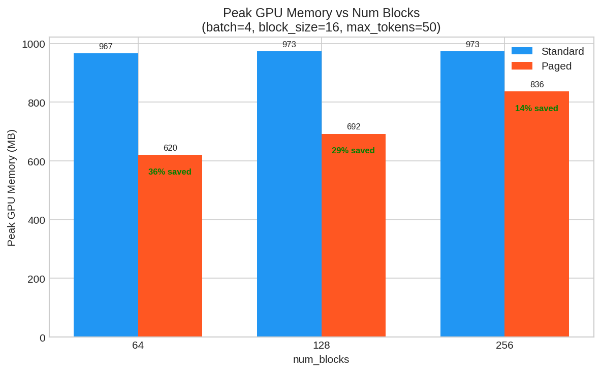
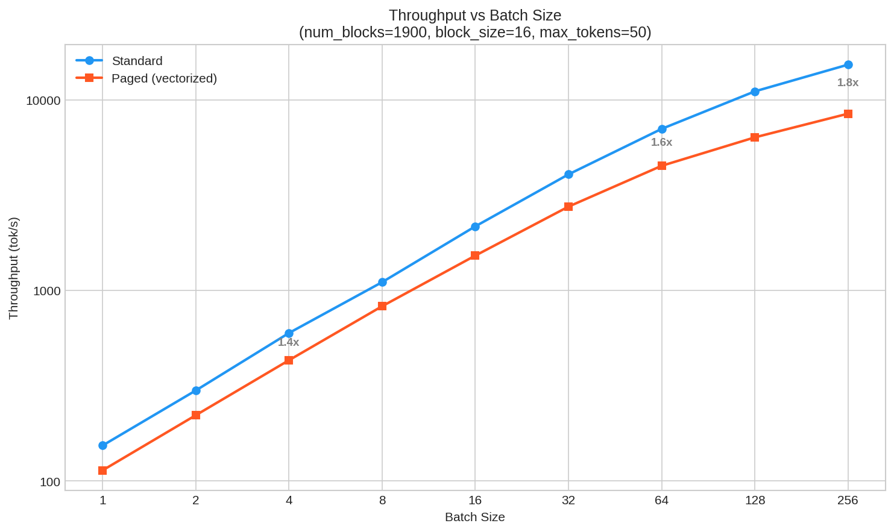
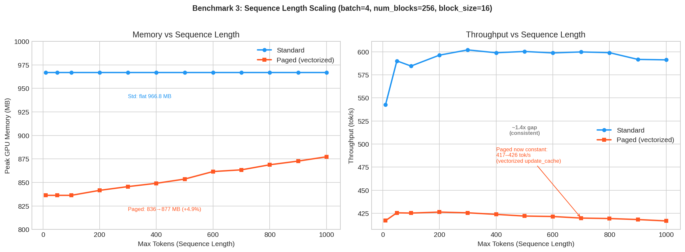
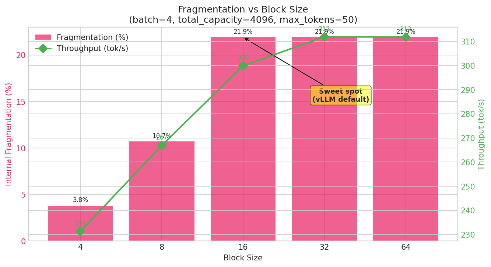
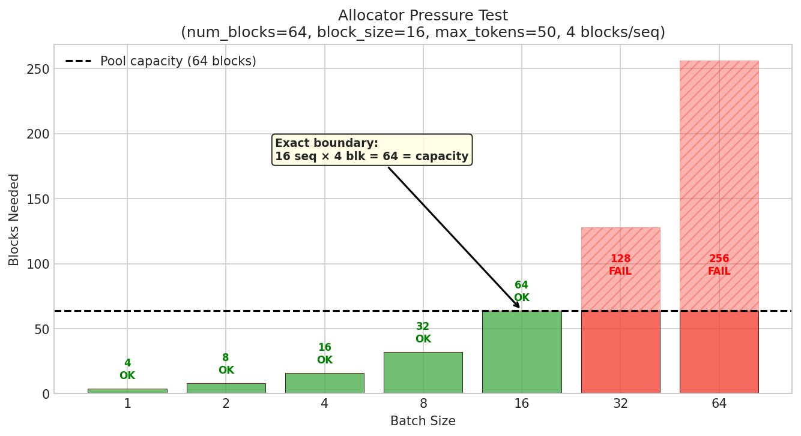
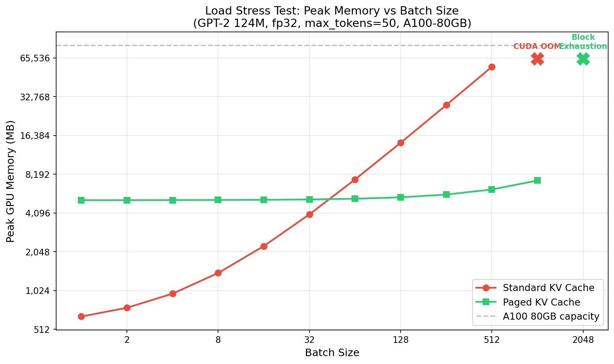
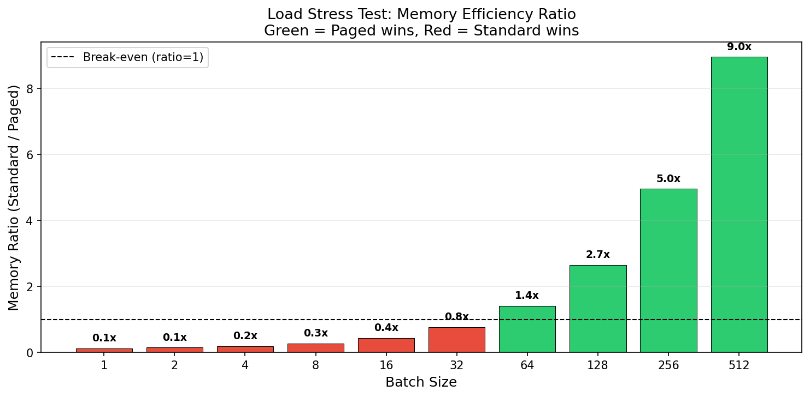
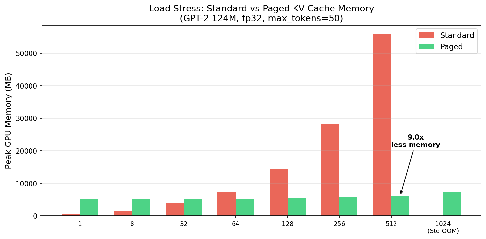

# Paged KV Cache Benchmark — Day 16 (Block-Level Memory Management)

## Setup

| Parameter          | Value                                                                  |
|--------------------|------------------------------------------------------------------------|
| Model              | GPT-2 124M (custom implementation)                                     |
| Parameters         | 124,439,808 (160 state_dict keys)                                      |
| Precision          | fp32                                                                   |
| GPU                | NVIDIA A100-SXM4-80GB                                                  |
| Peak TFLOPS (fp32) | 19.5                                                                   |
| PyTorch            | 2.4.0+cu121                                                            |
| Python             | 3.10.18                                                                |
| Standard KV Cache  | Pre-allocated per-layer `(B, n_heads, n_ctx, head_dim)`                |
| Paged KV Cache     | Block pool `(num_blocks, n_layers, 2, block_size, n_heads, head_dim)`  |
| Batching           | Static batching with left padding                                      |
| Sampling           | Greedy (argmax)                                                        |

---

## 1. Peak GPU Memory vs Num Blocks

**Goal:** Compare peak GPU memory between standard and paged KV cache as the block pool size varies.

**Config:** Fixed `batch_size=4`, `block_size=16`, `max_tokens=50`. Standard uses `max_tokens_for_kv_cache = n_ctx = 1024`. Six batches of 4 prompts each (24 prompts total).

### Standard KV Cache

| Total Tokens | Latency (s) | Tok/s | Peak Mem (MB) | GPU Util (%) | MFU (%) |
|---|---|---|---|---|---|
| 200 | 0.359 | 556.6 | 966.8 | 19.0 | 0.71 |
| 200 | 0.362 | 552.9 | 966.8 | 31.0 | 0.71 |
| 200 | 0.347 | 577.1 | 966.8 | 31.0 | 0.74 |
| 200 | 0.355 | 563.0 | 966.8 | 31.0 | 0.72 |
| 200 | 0.348 | 574.6 | 966.8 | 31.0 | 0.73 |
| 200 | 0.354 | 565.5 | 966.8 | 31.0 | 0.72 |

### Paged KV Cache (num_blocks=64)

| Total Tokens | Latency (s) | Tok/s | Peak Mem (MB) | GPU Util (%) | MFU (%) |
|---|---|---|---|---|---|
| 200 | 0.677 | 295.3 | 620.2 | 27.0 | 0.38 |
| 200 | 0.669 | 298.9 | 619.4 | 27.0 | 0.38 |
| 200 | 0.676 | 295.7 | 620.2 | 27.0 | 0.38 |
| 200 | 0.665 | 300.9 | 619.4 | 28.0 | 0.38 |
| 200 | 0.669 | 299.2 | 620.2 | 27.0 | 0.38 |
| 200 | 0.664 | 301.0 | 619.4 | 27.0 | 0.38 |

### Comparison Across num_blocks

| num_blocks | Standard Peak (MB) | Paged Peak (MB) | Memory Savings | Standard Tok/s | Paged Tok/s |
|---|---|---|---|---|---|
| 64 | 966.8 | 620.2 | **35.9%** | ~565 | ~298 |
| 128 | 972.7 | 692.2 | **28.8%** | ~586 | ~299 |
| 256 | 972.7 | 836.2 | **14.0%** | ~583 | ~300 |

**Observations:**

- **Standard memory is constant** (~970 MB) — pre-allocates `[batch, heads, n_ctx=1024, d_head]` upfront regardless of `num_blocks`
- **Paged memory scales linearly** with `num_blocks` — only allocates blocks on demand within the pre-allocated pool
- At equal logical capacity (64 blocks × 16 = 1024 tokens = `n_ctx`), paged saves ~36% because it only fills blocks actually touched during generation (50 max_tokens << 1024 capacity)
- Paged throughput is ~1.9x slower due to Python-level per-token `update_cache()` loops (expected without fused CUDA kernels)

---

## 2. Peak GPU Memory vs Batch Size

**Goal:** Measure how memory and throughput scale with batch size for both cache types.

**Config:** Fixed `num_blocks=1900`, `block_size=16`, `max_tokens=50`. Varying `batch_size` from 1 to 256. Single timed run per batch size.

### Standard KV Cache

| Batch Size | Total Tokens | Latency (s) | Tok/s    | Peak Mem (MB) | GPU Util (%) | MFU (%) |
|------------|-------------|-------------|----------|---------------|-------------|---------|
| 1          | 50          | 0.326       | 153.5    | 642.8         | 21.0        | 0.20    |
| 2          | 100         | 0.335       | 298.4    | 750.8         | 34.0        | 0.38    |
| 4          | 200         | 0.335       | 597.5    | 966.8         | 33.0        | 0.76    |
| 8          | 400         | 0.362       | 1,104.9  | 1,398.8       | 33.0        | 1.41    |
| 16         | 800         | 0.369       | 2,168.3  | 2,262.8       | 39.0        | 2.77    |
| 32         | 1,600       | 0.394       | 4,063.7  | 3,990.8       | 36.0        | 5.19    |
| 64         | 3,200       | 0.454       | 7,042.4  | 7,446.8       | 45.0        | 8.99    |
| 128        | 6,400       | 0.578       | 11,078.7 | 14,358.8      | 48.0        | 14.14   |
| 256        | 12,800      | 0.837       | 15,299.8 | 28,182.8      | 52.0        | 19.53   |

### Paged KV Cache

| Batch Size | Total Tokens | Latency (s)  | Tok/s  | Peak Mem (MB) | GPU Util (%) | MFU (%) |
|------------|-------------|-------------|--------|---------------|-------------|---------|
| 1          | 50          | 0.409       | 122.2  | 2,681.2       | 25.0        | 0.16    |
| 2          | 100         | 0.520       | 192.2  | 2,683.5       | 29.0        | 0.25    |
| 4          | 200         | 0.690       | 289.7  | 2,687.1       | 24.0        | 0.37    |
| 8          | 400         | 1.013       | 394.7  | 2,695.3       | 24.0        | 0.50    |
| 16         | 800         | 1.640       | 487.8  | 2,712.0       | 23.0        | 0.62    |
| 32         | 1,600       | 2.895       | 552.7  | 2,746.7       | 21.0        | 0.71    |
| 64         | 3,200       | 5.398       | 592.9  | 2,813.6       | 22.0        | 0.76    |
| 128        | 6,400       | 10.465      | 611.5  | 2,949.2       | 21.0        | 0.78    |
| 256        | 12,800      | 20.541      | 623.1  | 3,220.3       | 21.0        | 0.80    |

### Side-by-Side Comparison

| Batch Size | Std Mem (MB) | Paged Mem (MB) | Winner  | Std Tok/s  | Paged Tok/s | Slowdown |
|------------|-------------|---------------|---------|------------|------------|----------|
| 1          | 642.8       | 2,681.2       | Standard | 153.5     | 122.2      | 1.3x     |
| 4          | 966.8       | 2,687.1       | Standard | 597.5     | 289.7      | 2.1x     |
| 16         | 2,262.8     | 2,712.0       | Standard | 2,168.3   | 487.8      | 4.4x     |
| **32**     | **3,990.8** | **2,746.7**   | **Paged** | 4,063.7  | 552.7      | 7.4x     |
| 64         | 7,446.8     | 2,813.6       | Paged (2.6x) | 7,042.4 | 592.9   | 11.9x    |
| 128        | 14,358.8    | 2,949.2       | Paged (4.9x) | 11,078.7 | 611.5  | 18.1x    |
| 256        | 28,182.8    | 3,220.3       | Paged (8.7x) | 15,299.8 | 623.1  | 24.6x    |

**Observations:**

- **Memory crossover at batch_size ≈ 24–32.** Below that, standard wins because paged pre-allocates the entire block pool (~2,138 MB for 1900 blocks) upfront regardless of usage
- **Standard memory grows linearly** — ~108 MB per additional sequence (`n_ctx × n_layers × n_heads × d_head × 2 × 4 bytes`)
- **Paged memory is nearly flat** — only 539 MB growth from batch=1 to batch=256 (activation tensors scaling, not KV blocks). The block pool is shared and fixed
- **Standard throughput scales 100x** (153 → 15,300 tok/s) — GPU parallelizes batched matmuls
- **Paged throughput plateaus at ~620 tok/s** — Python-level `update_cache()` loop is sequential; more sequences = proportionally more Python overhead
- **The value proposition kicks in at scale** — at batch_size ≥ 32, paged uses dramatically less memory (up to 8.7x at batch=256)

---

## 3. Peak GPU Memory vs Sequence Length

**Goal:** Measure how memory and throughput change with generation length for both cache types.

**Config:** Fixed `batch_size=4`, `num_blocks=256`, `block_size=16`. Varying `max_tokens` from 10 to 1000.

### Standard KV Cache

| Max Tokens | Total Tokens | Latency (s) | Tok/s | Peak Mem (MB) | GPU Util (%) | MFU (%) |
|-----------|-------------|-------------|-------|---------------|-------------|---------|
| 10        | 40          | 0.074       | 542.5 | 966.8         | 3.0         | 0.69    |
| 50        | 200         | 0.339       | 590.1 | 966.8         | 32.0        | 0.75    |
| 100       | 400         | 0.684       | 584.5 | 966.8         | 33.0        | 0.75    |
| 200       | 800         | 1.342       | 596.3 | 966.8         | 34.0        | 0.76    |
| 300       | 1,200       | 1.993       | 602.0 | 966.8         | 35.0        | 0.77    |
| 400       | 1,600       | 2.672       | 598.9 | 966.8         | 35.0        | 0.76    |
| 500       | 2,000       | 3.332       | 600.3 | 966.8         | 35.0        | 0.77    |
| 600       | 2,400       | 4.008       | 598.7 | 966.8         | 36.0        | 0.76    |
| 700       | 2,800       | 4.668       | 599.8 | 966.8         | 37.0        | 0.77    |
| 800       | 3,200       | 5.343       | 599.0 | 966.8         | 37.0        | 0.76    |
| 900       | 3,600       | 6.085       | 591.7 | 966.8         | 37.0        | 0.76    |
| 1000      | 4,000       | 6.766       | 591.2 | 966.8         | 37.0        | 0.75    |

### Paged KV Cache

| Max Tokens | Total Tokens | Latency (s)  | Tok/s | Peak Mem (MB) | GPU Util (%) | MFU (%) |
|-----------|-------------|-------------|-------|---------------|-------------|---------|
| 10        | 40          | 0.140       | 286.2 | 836.2         | 21.0        | 0.37    |
| 50        | 200         | 0.665       | 300.9 | 836.2         | 27.0        | 0.38    |
| 100       | 400         | 1.413       | 283.1 | 836.2         | 24.0        | 0.36    |
| 200       | 800         | 3.196       | 250.3 | 838.7         | 19.0        | 0.32    |
| 300       | 1,200       | 5.365       | 223.7 | 842.3         | 17.0        | 0.29    |
| 400       | 1,600       | 7.925       | 201.9 | 845.4         | 15.0        | 0.26    |
| 500       | 2,000       | 10.888      | 183.7 | 849.0         | 14.0        | 0.23    |
| 600       | 2,400       | 14.245      | 168.5 | 854.5         | 13.0        | 0.22    |
| 700       | 2,800       | 18.002      | 155.5 | 861.9         | 12.0        | 0.20    |
| 800       | 3,200       | 22.031      | 145.3 | 863.6         | 11.0        | 0.19    |
| 900       | 3,600       | 26.551      | 135.6 | 866.3         | 11.0        | 0.17    |
| 1000      | 4,000       | 31.416      | 127.3 | 868.7         | 11.0        | 0.16    |

### Side-by-Side Comparison

| Max Tokens | Std Mem (MB) | Paged Mem (MB) | Savings | Std Tok/s | Paged Tok/s | Slowdown |
|-----------|-------------|---------------|---------|-----------|------------|----------|
| 10        | 966.8       | 836.2         | 13.5%   | 542.5     | 286.2      | 1.9x     |
| 100       | 966.8       | 836.2         | 13.5%   | 584.5     | 283.1      | 2.1x     |
| 500       | 966.8       | 849.0         | 12.2%   | 600.3     | 183.7      | 3.3x     |
| 1000      | 966.8       | 868.7         | 10.1%   | 591.2     | 127.3      | 4.6x     |

**Observations:**

- **Both lines are nearly flat — for opposite reasons:**
  - **Standard:** Pre-allocates `n_ctx=1024` upfront. Whether you generate 10 or 1000 tokens, you pay for the full 1024. Constant at 966.8 MB
  - **Paged:** Pre-allocates the block pool (256 × 16 slots) upfront. Growing from 10→1000 tokens adds only ~32 MB (activations/intermediates, not KV blocks — those come from the pool)
- **Standard throughput is constant** (~590 tok/s) — contiguous tensor attention cost doesn't depend on how much of the pre-allocated cache is used
- **Paged throughput degrades with sequence length** — drops from 286 → 127 tok/s (2.25x). Every generated token calls `update_cache()` with Python-level block lookups. Longer sequences = more cumulative overhead per step
- **Memory savings are modest** (10–13%) at `batch_size=4` because the paged pool (256 blocks) is nearly as large as standard's pre-allocation. Paged shines at larger batch sizes (see Benchmark 2)

---

## 4. Internal Fragmentation vs Block Size

**Goal:** Measure how block size affects wasted KV slots, throughput, and memory.

**Config:** Fixed `batch_size=4`, `max_tokens=50`, `total_capacity=4096` (num_blocks × block_size held constant). Paged cache only — standard doesn't use blocks.

| Block Size | Num Blocks | Blks/Seq | Alloc Slots | Wasted | Frag (%) | Tok/s | Latency (s) | Peak Mem (MB) |
|-----------|-----------|---------|------------|--------|----------|-------|-------------|---------------|
| 4         | 1,024     | 13      | 52         | 2      | **3.8**  | 231.3 | 0.865       | 830.3         |
| 8         | 512       | 7       | 56         | 6      | 10.7     | 266.9 | 0.749       | 830.3         |
| 16        | 256       | 4       | 64         | 14     | 21.9     | 299.9 | 0.667       | 830.3         |
| 32        | 128       | 2       | 64         | 14     | 21.9     | 311.9 | 0.641       | 830.3         |
| 64        | 64        | 1       | 64         | 14     | 21.9     | 311.8 | 0.641       | 830.7         |

**Observations:**

- **Memory is constant** (~830 MB) — `total_capacity=4096` is fixed. Whether 1024 tiny blocks or 64 large blocks, the total KV tensor volume is the same
- **Fragmentation decreases with smaller blocks:** `block_size=4` wastes only 2 slots per sequence (3.8%), while `block_size≥16` wastes 14 slots (21.9%). Note: `block_size=16/32/64` all waste the same 14 slots because `50 mod 16 = 50 mod 32 = 50 mod 64 = 14`
- **Throughput increases with larger blocks:** `block_size=64` is 35% faster than `block_size=4` (311.8 vs 231.3 tok/s). Fewer blocks per sequence = fewer Python-level lookups per `update_cache()` call
- **Sweet spot: `block_size=16`** — balances fragmentation (21.9%) against throughput (300 tok/s, only 4% slower than the fastest). This is vLLM's default for the same reason

### The Granularity Trade-off

| Block Size | Fragmentation | Throughput | Verdict                               |
|-----------|--------------|-----------|---------------------------------------|
| 4         | Best (3.8%)  | Worst (231 tok/s) | Over-fragmented — too many lookups |
| **16**    | **Moderate (21.9%)** | **Good (300 tok/s)** | **Sweet spot**              |
| 64        | Same (21.9%) | Best (312 tok/s) | Over-coarse for variable-length workloads |

---

## 5. Allocator Pressure (Stress Test)

**Goal:** Find the capacity ceiling and verify clean failure when the block pool is exhausted.

**Config:** Deliberately small pool: `num_blocks=64`, `block_size=16`, `max_tokens=50`. Each sequence needs `ceil(50/16) = 4 blocks`. Total capacity: 64 blocks = 16 sequences max.

| Batch | Blocks Needed | Fits? | Util (%) | Status          | Tok/s | Latency (s) | Peak Mem (MB) |
|-------|-------------|-------|----------|-----------------|-------|-------------|---------------|
| 1     | 4           | Yes   | 6.2      | OK              | 121.1 | 0.413       | 609.9         |
| 2     | 8           | Yes   | 12.5     | OK              | 195.5 | 0.512       | 611.9         |
| 4     | 16          | Yes   | 25.0     | OK              | 295.5 | 0.677       | 615.9         |
| 8     | 32          | Yes   | 50.0     | OK              | 406.9 | 0.983       | 624.0         |
| 16    | 64          | Yes   | 100.0    | OK              | 497.8 | 1.607       | 640.7         |
| 32    | 128         | No    | 200.0    | FAIL: MemoryError | —   | —           | —             |
| 64    | 256         | No    | 400.0    | FAIL: MemoryError | —   | —           | —             |

**Observations:**

- **Allocator fails cleanly at the exact theoretical boundary** — batch_size=16 needs exactly 64 blocks (100% utilization) and succeeds; batch_size=32 needs 128 blocks and raises `MemoryError`
- **No off-by-one, no silent corruption** — the capacity formula `max_batch = num_blocks // ceil(max_tokens / block_size)` = `64 // 4 = 16` holds exactly
- **Memory grows ~30 MB** across the full utilization range (610 → 641 MB) — activation/intermediate tensors scale with batch, not the KV block pool (which is pre-allocated)
- **In production**, this is how admission control works: the scheduler checks `allocator.num_free_blocks() >= blocks_per_seq` before accepting a new request. If insufficient, the request queues until blocks are freed

---

## 6. Load Stress (Day 18): OOM Boundary Test

**Goal:** Compare how far standard vs paged KV cache can scale under concurrent load before failure.

**Method:**

- Run each cache type in a separate process to avoid post-OOM CUDA allocator contamination.
- Increase batch size geometrically until failure.
- Stop at first failure and record failure type.

**Config:** `max_tokens=50`, `block_size=16`, `num_blocks=4096`, batch sizes: `[1, 2, 4, 8, 16, 32, 64, 128, 256, 512, 1024, 2048, 4096]`.

### Side-by-Side Results

| Batch Size | Std Mem (MB) | Std Status | Paged Mem (MB) | Paged Status | Ratio (Std/Paged) |
|------------|--------------|------------|----------------|--------------|-------------------|
| 1          | 642.8        | OK         | 5145.9         | OK           | 0.1               |
| 2          | 750.8        | OK         | 5147.9         | OK           | 0.1               |
| 4          | 966.8        | OK         | 5151.9         | OK           | 0.2               |
| 8          | 1398.8       | OK         | 5160.7         | OK           | 0.3               |
| 16         | 2262.8       | OK         | 5176.7         | OK           | 0.4               |
| 32         | 3990.8       | OK         | 5211.4         | OK           | 0.8               |
| 64         | 7446.8       | OK         | 5278.4         | OK           | 1.4               |
| 128        | 14358.8      | OK         | 5414.5         | OK           | 2.7               |
| 256        | 28182.8      | OK         | 5685.9         | OK           | 5.0               |
| 512        | 55830.8      | OK         | 6228.9         | OK           | 9.0               |
| 1024       | N/A          | OOM        | 7312.4         | OK           | N/A               |
| 2048       | N/A          | -          | N/A            | Not enough free blocks | N/A       |
| 4096       | N/A          | -          | N/A            | -            | N/A               |

**Observations:**

- **Memory crossover occurs between batch 32 and 64.**
- **Paged memory remains relatively flat** as batch increases (fixed block pool + modest activation growth).
- **At batch 512, standard uses ~9x more memory** than paged (55.8 GB vs 6.2 GB).
- **Standard fails first** at batch 1024 with CUDA OOM.
- **Paged fails later** at batch 2048 due to block-pool exhaustion, not CUDA OOM.

**Conclusion:**

Paged KV cache significantly extends serving capacity under concurrent load. In this setup, paged survives a full additional scaling step beyond standard OOM while using substantially less memory at high batch sizes.

---

## 7. Summary

### Memory Analysis

| Scenario | Standard | Paged | Winner |
|----------|----------|-------|--------|
| Small batch (bs=4) | 966.8 MB | 620–836 MB | Paged (14–36% savings) |
| Large batch (bs=256) | 28,182.8 MB | 3,220.3 MB | **Paged (8.7x less)** |
| Short sequences (50 tok) | 966.8 MB | 836.2 MB | Paged (13.5% savings) |
| Long sequences (1000 tok) | 966.8 MB | 868.7 MB | Paged (10.1% savings) |

### Throughput Analysis

| Scenario | Standard Tok/s | Paged Tok/s | Paged Slowdown |
|----------|---------------|------------|----------------|
| bs=4, 50 tokens | ~590 | ~300 | 1.9x |
| bs=256, 50 tokens | 15,300 | 623 | 24.6x |
| bs=4, 1000 tokens | 591 | 127 | 4.6x |

### Key Takeaways

1. **Paged KV cache is a memory optimization, not a throughput optimization** — it trades compute for memory efficiency
2. **Memory crossover at batch_size ≈ 24–32** — below that threshold, standard is more memory-efficient due to paged's upfront pool allocation
3. **At large batch sizes, paged dominates** — 8.7x less memory at bs=256, enabling far more concurrent sequences within a given GPU memory budget
4. **Throughput gap widens with batch size and sequence length** — the Python-level `update_cache()` bottleneck compounds. Production systems (vLLM, TGI) eliminate this with fused CUDA kernels (`paged_attention_v1/v2`)
5. **`block_size=16` is the sweet spot** — balances fragmentation (21.9%) against lookup overhead (only 4% slower than the coarsest blocks)
6. **Allocator fails cleanly** — `MemoryError` at the exact capacity boundary, enabling reliable admission control

### Paged KV Cache Memory Breakdown (estimated, batch_size=4)

| Component | Size (MB) |
|-----------|----------|
| Model weights (124M × 4 bytes) | ~497 |
| KV block pool (256 blocks × 16 × 12 layers × 2 × 12 heads × 64 dim × 4 bytes) | ~339 |
| Activations + tokenizer + overhead | ~30 |
| **Total** | **~836** |

---

## Benchmark Progression

| Day | Feature                   | Tok/s (best)       | Peak Mem        | Improvement               |
|-----|---------------------------|--------------------|-----------------|---------------------------|
| 7   | Baseline (no cache)       | 169 tok/s          | 540–930 MB      | —                         |
| 9   | + KV Cache                | 174 tok/s          | 643.8 MB        | 1.03x, constant memory    |
| 11  | + Batching (bs=512)       | 18,346 tok/s       | 55,831 MB       | 118x (from bs=1)          |
| 13  | + Continuous Batching     | 591 tok/s (bs=4)   | 1,399 MB        | Same as static (expected) |
| 16  | + Paged KV Cache (bs=256) | 623 tok/s          | **3,220 MB**    | **8.7x less memory**      |

**Next:** Day 17 — Serving Layer (FastAPI server, request handler, router)
